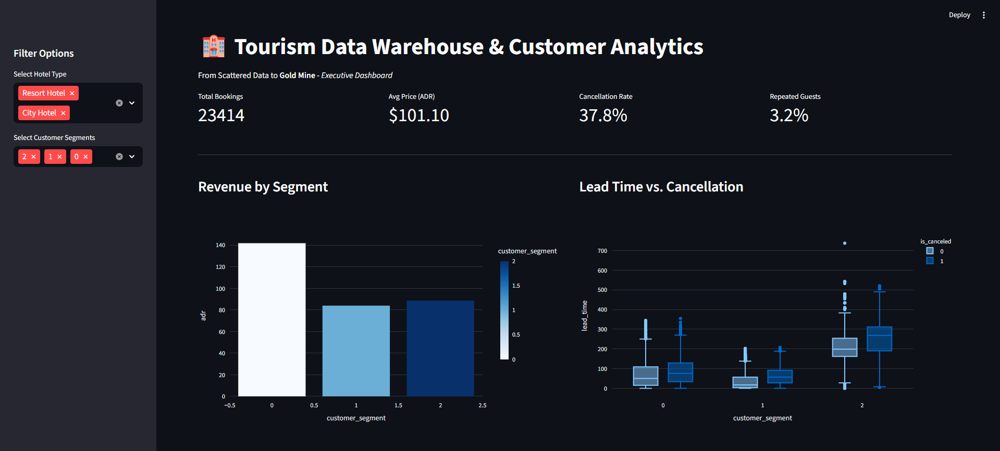

# Scattered Data to Gold Mine: Tourism Data Warehouse & Customer Analytics



## Project Overview
In the modern tourism industry, data is often scattered across different platforms (CRMs, Excel sheets, Web APIs). This project simulates a real-world scenario where I extracted messy data from multiple sources, built a structured **Data Warehouse**, performed **Customer Segmentation** using Machine Learning, and deployed an **Interactive Executive Dashboard**.

### Key Achievements:
- **Data Engineering:** Managed an ETL pipeline to merge JSON (Web), Excel (CRM), and CSV (Finance) data.
- **Machine Learning:** Identified 4 distinct customer personas using **K-Means Clustering**.
- **Business Intelligence:** Created a real-time dashboard for executives to track KPIs like Cancellation Rates and ADR.

---

## Tech Stack
- **Language:** Python 3.12
- **Data Engineering:** Pandas, NumPy, OpenPyXL (ETL Pipeline)
- **Machine Learning:** Scikit-Learn (K-Means Clustering, StandardScaler)
- **Visualization:** Plotly, Seaborn, Matplotlib
- **Deployment:** Streamlit (Web Application)

---

## The 7-Day Journey

### Phase 1: Data Chaos & ETL
I took a clean dataset and intentionally broke it into three messy parts to simulate real-world data silos. I then built an ETL script to:
- Standardize date formats.
- Handle missing values using median imputation.
- Merge sources on a unique `reservation_id`.

### Phase 2: Exploratory Data Analysis (EDA) 
I uncovered critical business insights:
- **Lead Time Effect:** Reservations made >200 days in advance have a significantly higher cancellation risk.
- **Channel Profitability:** Direct and Online TA segments provide the highest ADR (Average Daily Rate).

### Phase 3: Customer Segmentation (ML) 
Using the **Elbow Method**, I determined the optimal number of clusters (K=4) to group customers:
1. **VIP Spenders:** High ADR, many special requests.
2. **Early Bird Planners:** Long lead time, high cancellation risk.
3. **Loyal Business Travelers:** High repeat guest rate, short stays.
4. **Budget Seekers:** Low ADR, standard requirements.

### Phase 4: Executive Dashboard 
The final deliverable is a **Streamlit Web App** that allows managers to:
- Filter data by hotel type and customer segment.
- View real-time KPIs.
- Make data-driven decisions based on automated recommendations.

---

## Strategic Recommendations
- **Risk Mitigation:** Apply a non-refundable deposit policy for the "Early Bird" segment.
- **Revenue Growth:** Design "Loyalty Packages" specifically for the business segment to increase mid-week occupancy.
- **VIP Retention:** Offer complimentary services (e.g., spa, late check-out) to the High-Spender segment to maintain their 100+ ADR.

---

## How to Run
1. Clone the repository:
   ```bash
   git clone https://github.com/Sudeguslu/Tourism-Data-Warehouse-Analytics.git
2. Install dependencies:
   ```bash
   pip install -r requirements.txt
3.Run the Dashboard:
   ```bash
   streamlit run app.py
   
